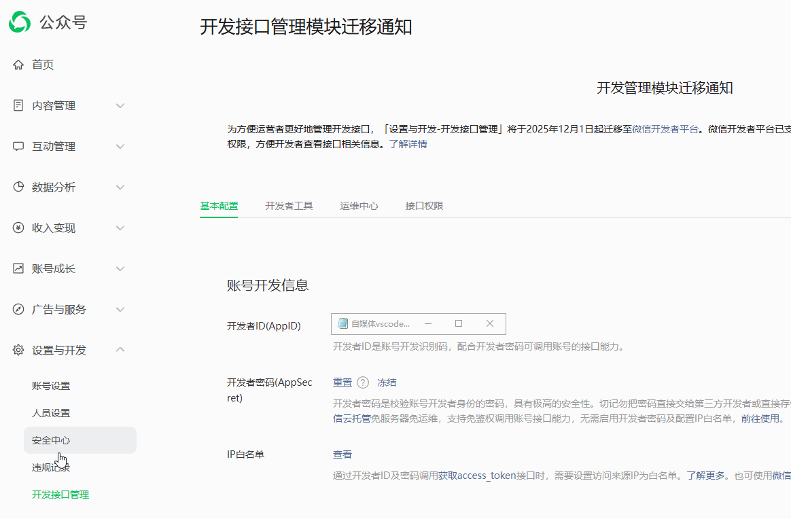
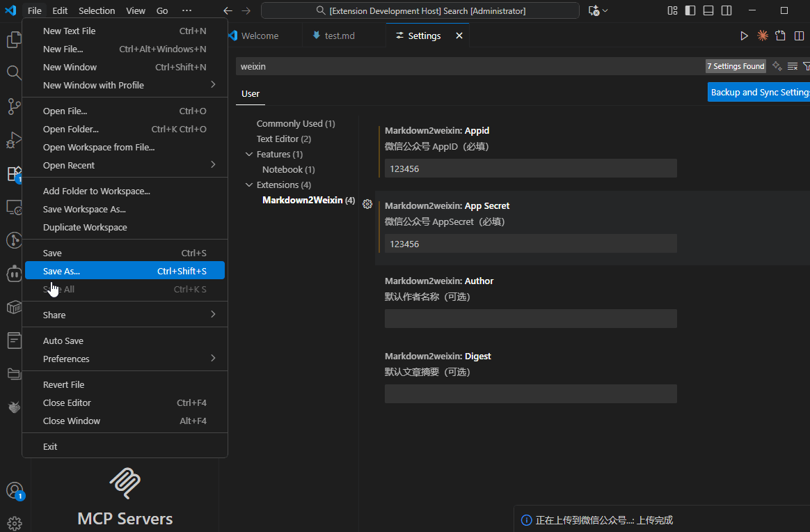
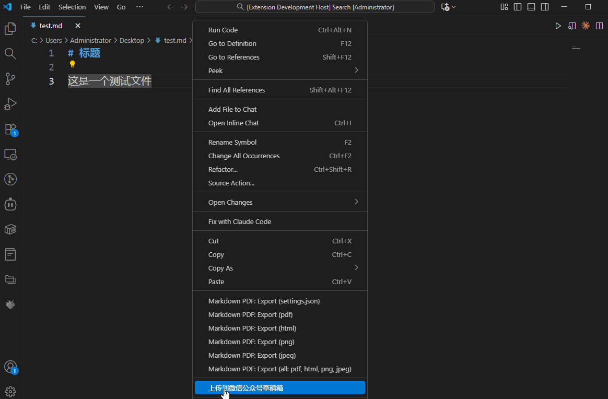

# Markdown2Weixin（Markdown 一键导入微信公众号）

🚀 一款让你轻松将 Markdown 文档导入微信公众号草稿箱的 VS Code 扩展！

## ✨ 功能特性

- 📝 **一键上传**：在 Markdown 文件中右键即可上传到微信公众号草稿箱
- 🎨 **格式保留**：完美保留 Markdown 格式，包括标题、粗体、代码块等
- ⚙️ **简单配置**：只需配置 appid 和 app_secret 即可使用
- 🔄 **实时反馈**：上传进度提示，成功后显示 media_id
- 📦 **智能提取**：自动提取文章标题、支持自定义作者和摘要

## 📦 安装

1. 在 VS Code 扩展市场搜索 `Markdown2Weixin`
2. 点击安装
3. 重启 VS Code

## 🔧 配置说明

在使用之前，你需要配置微信公众号的 appid 和 app_secret：

1. 打开 VS Code 设置（`Ctrl+,` 或 `Cmd+,`）
2. 搜索 `markdown2weixin`
3. 填写以下配置项：

### 必填配置

- **`markdown2weixin.appid`**：你的微信公众号 AppID
- **`markdown2weixin.appSecret`**：你的微信公众号 AppSecret

### 可选配置

- **`markdown2weixin.author`**：默认作者名称（留空则不设置）
- **`markdown2weixin.digest`**：默认文章摘要（留空则不设置）

### 如何获取 AppID 和 AppSecret？



1. 登录微信公众平台：https://mp.weixin.qq.com/
2. 进入「设置与开发」->「基本配置」
3. 在「开发者ID(AppID)」和「开发者密码(AppSecret)」中获取

## 🎯 使用方法

### 步骤 1：配置扩展



1. 打开 VS Code 设置（`Ctrl+,` 或 `Cmd+,`）
2. 搜索 `markdown2weixin`
3. 填写你的微信公众号 AppID 和 AppSecret
4. 可选：填写默认作者名称和文章摘要

### 步骤 2：上传 Markdown 文件



1. 在 VS Code 中打开任意 Markdown 文件
2. 在编辑器中右键点击
3. 选择「上传到微信公众号草稿箱」（Upload to WeChat）
4. 等待上传完成，查看结果提示

### 使用效果

- ✅ 上传成功：显示 media_id 和成功提示
- ❌ 上传失败：显示详细错误信息

## 📋 API 说明

本扩展使用 [FastPen](https://www.fastpen.online/) 提供的 API 服务：

**API 地址**：`https://www.fastpen.online/api/draft/multi/import-markdown`

**请求参数**：
```json
{
  "markdown": "# 标题\n\n这是**粗体**文本",
  "title": "文章标题",
  "appid": "your-appid",
  "app_secret": "your-app-secret",
  "author": "作者名称",
  "digest": "文章摘要"
}
```

**响应示例**：
```json
{
  "success": true,
  "data": {
    "media_id": "MEDIA_ID",
    "created_at": 1640995200000,
    "title": "文章标题",
    "content_preview": "内容预览..."
  },
  "message": "从Markdown导入成功"
}
```

## 🔒 隐私和安全

- 你的 appid 和 app_secret 仅存储在本地 VS Code 配置中
- 所有数据传输通过 HTTPS 加密
- 不会收集或存储你的任何文章内容

## 🐛 已知问题

目前暂无已知问题。如果你遇到任何问题，请在 [GitHub Issues](https://github.com/your-repo/markdown2weixin/issues) 中反馈。

## 📝 Release Notes

### 0.0.1

🎉 初始版本发布
- 实现 Markdown 一键上传到微信公众号草稿箱
- 支持配置 appid、app_secret、author、digest
- 自动提取文章标题
- 完善的错误提示和成功反馈

## 🤝 贡献

欢迎提交 Issue 和 Pull Request！

## 📄 License

MIT

---

**Enjoy!** 如果觉得好用，请给个 ⭐️ Star！
